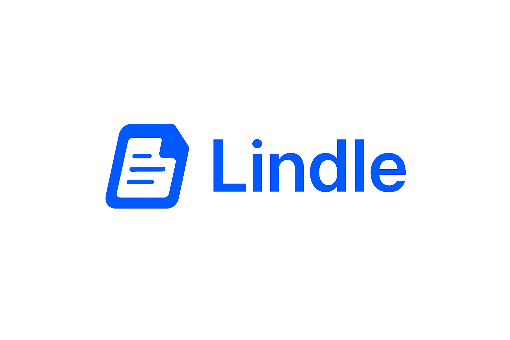

# Lindle MVP 
**All your contracts. One companion. Smart. Clear. Fun.**

**AI-powered contract assistant** for freelancers, consultants, and agencies.  
Upload a contract and Lindle will instantly deliver:  
- 📄 A **clear summary** of the document  
- ⚠️ **Red flags** to watch out for  
- 💡 **Pushback suggestions** you can use in negotiations  
- 📥 A downloadable **PDF review report**    

🌍 **Vision**  
To empower the global solo economy with clarity and confidence in every contract, making legal language as accessible as everyday conversation.  

🎯 **Mission**  
Lindle is building an AI-powered contract companion that helps freelancers, consultants, and agencies instantly understand, negotiate, and manage their agreements — from red flag detection and pushback suggestions to reminders, clause storage, and live contract chat.  


## Features
- Upload **PDF, DOCX, or TXT** contracts  
- Get **AI-generated insights** in real-time  
- Simple, intuitive **web interface** (HTML + TailwindCSS)  
- Backend built with **FastAPI + OpenAI API**  
- Export a professional **PDF report** (summary, red flags, pushbacks)  


## Tech Stack
- **Backend:** FastAPI, OpenAI API, ReportLab, PyMuPDF, python-docx  
- **Frontend:** HTML + TailwindCSS  
- **Server:** Uvicorn (local dev)
  


## Roadmap (Beyond MVP)

The current MVP focuses on contract analysis (summary, red flags, pushbacks, PDF export).  
In the next iterations, Lindle will expand into a **full AI-powered contract workspace** for freelancers and agencies:

- 💬 **Live Contract Chat** – ask questions directly about your contract in plain language.  
- 📂 **Personal Clause/Contract Vault** – save your preferred clauses for reuse in future negotiations and store your contracts.  
- ⏰ **Smart Reminders** – get nudges for deadlines, renewals, or unpaid invoices linked to contracts.  
- 🤝 **Reputation Tracker** – keep a history of past clients/vendors with contract outcomes.  
- 📊 **Insights Dashboard** – visualize risk exposure and negotiation wins across contracts.  


## Run Locally

Clone the project:

```bash
git clone https://github.com/amardizdarevic45-wq/Lindle.git
cd Lindle

# Install backend dependencies
cd Backend
python3 -m venv .venv
source .venv/bin/activate  # On Windows: .venv\Scripts\activate
pip install -r requirements.txt

# Set up OpenAI API key
export OPENAI_API_KEY=sk-...
# Optional for project-based keys:
export OPENAI_PROJECT=proj_...

# Start the backend server
uvicorn lindle_mvp_backend_fastapi:app --reload

# In a new terminal, start the React frontend
cd ../Frontend
npm install
npm start

# The React app will open in your browser at http://localhost:3000
```

For production deployment:

```bash
# Build the React app for production
cd Frontend
npm run build

# Serve the build folder with any static file server
# Example with a simple Python server:
cd build
python3 -m http.server 3000
```

## Project Structure

```
Lindle/
├── Backend/
│   ├── lindle_mvp_backend_fastapi.py    # FastAPI backend with reputation tracking
│   └── requirements.txt                  # Python dependencies
├── Frontend/                             # React application
│   ├── public/                           # Static assets
│   │   ├── lindle-logo-transparent.png  # Logo assets
│   │   └── lindle-logo.png
│   ├── src/
│   │   ├── components/                   # React components
│   │   │   ├── LindleApp.js             # Main app component
│   │   │   ├── Navigation.js            # Navigation tabs
│   │   │   ├── ContractAnalysis.js      # Contract analysis feature
│   │   │   ├── ReputationTracker.js     # Reputation management
│   │   │   └── EntityModal.js           # Entity detail modal
│   │   ├── App.js                       # App entry point
│   │   └── index.js                     # React DOM render
│   ├── package.json                     # Node.js dependencies
│   └── README.md                        # React app documentation
├── Frontend_backup/                     # Backup of original HTML files
└── README.md
```
